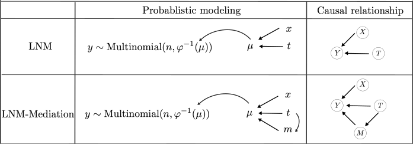
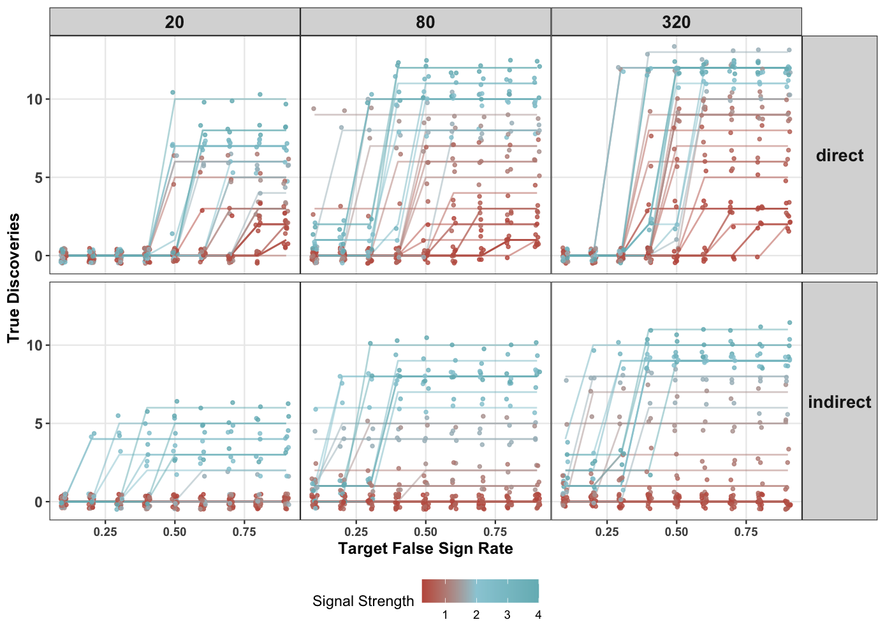

This analysis is developed with Hanying Jiang and Prof. Kris Sankaran.

In order to interpret the treatment effect on microbial composition along mediation pathways, we generalize the [Logistic Normal Multinomia (LNM)  model](https://doi.org/10.1186/s40168-021-01129-3) into a [mediation framework](https://doi.org/10.1037/a0020761). We estimate natural direct and indirect effects on synthetic datasets and evaluate its power across experimental configurations.

## Modeling

### The Base Model: Logistic Normal Multinomial


To associate microbiota profiles $Y\in\mathbb{N}^{K}$ with the treatment indicator $T\in\{0,1\}$, the Logistic Normal Multinomial assumes that taxa counts are drawn from a multinomial distribution with probability parameter ($\varphi^{-1}(\mu$)) that, after logit transformation ($\mu$), depends linearly on $T$. The size parameter is set to the sample's read depth, and pre-treatment covariates $X$ can be can be added to the regression on $\mu$ to control for their potential influence. 


As the name suggests, \textit{multinomial} accounts for varying read depths, \textit{normal} incorporates covariates, and \textit{logistic} bridges them together. 
Like other regression models, the LNM can be adapted to encode problem-specific assumptions, like the presence of mediators, which makes the mediation generalization possible.


```{r echo=FALSE, fig.align="center", fig.width=20, fig.height=20}
library(knitr)

``` 


Let $y_{i_r}\in\mathbb{N}^{K}$ be a length $K$ vector denoting the counts for the $r^{th}$ replicate of the $i^{th}$ sample, across $K$ genera among $n$ samples ($i=1,\cdots n$, $r=1, 2, 3$). Then formula \@ref(eq:lnmeta) and \@ref(eq:lnmmu) describe the linear regression on treatment and covariates, and formula \@ref(eq:lnmy) and \@ref(eq:phiinv) link the regression terms with the microbiome counts. $\eta_i\in\mathcal{R}^{K-1}$ is the expected value of $\mu_{i_r}$ and represents sample $i$'s typical microbiota profile on a logit scale. $\varphi^{-1}$ transforms $\mu_{i_r}$ from the logit scale into a probability. We use $N_{i_r}$ to represent the total count of $y_{i_r}$ and $\beta$'s  and $\sigma_d^2$ for unknown parameters.

\begin{equation} 
  \eta_i = \beta_0 + \beta_T  t_i +\beta_X ^{T} x_i
  (\#eq:lnmeta)
\end{equation} 


\begin{equation}
\mu_{i_r} \sim \text{Normal}(\eta_i , \text{diag}(\sigma_k^2 ))
  (\#eq:lnmmu)
\end{equation}

\begin{equation}
y_{i_r} \sim \text{Multinomial}(N_{i_r}, \varphi^{-1}(\mu_{i_r}))
   (\#eq:lnmy)
\end{equation}


\begin{equation}
\varphi^{-1}(\mu_{i_r}) =\left(\dfrac{\exp{\mu_{i_r, 1}}}{1 + \sum_{k=1}^{K-1}\exp{\mu_{i_r, k}}}, \cdots, \dfrac{\exp{\mu_{i_r, K-1}}}{1 + \sum_{k=1}^{K-1}\exp{\mu_{i_r, k}}}, \dfrac{1}{1 + \sum_{k=1}^{K-1}\exp{\mu_{i_r, k}}}
    \right)
    (\#eq:phiinv)
\end{equation}


### LNM + Mediation Framework


The LNM implies a causal relationship: intervention leads to microbiota shifts. To  illuminate the underlying mechanism, we assume the treatment effect to be modulated by some mediators ($M$). For example, the mindfulness training affects diet, which, as a mediator, affects the microbiome. In the causal graph with a mediation pathway, the treatment effect can be decomposed into two parts, the effect that works through mediators (indirect effect) and the effect that does not (direct effect). 


Mathematically, we replace the linear regression equation \@ref(eq:lnmeta) with two formulas: equations \@ref(eq:medreg1) for mediator $m_i$ and \@ref(eq:medreg2) for the sample mean $\eta_i$, where $\alpha$'s and $\sigma_d^2$ are unknown parameters representing the treatment's effect on mediators (for example, the influence of mindfulness training on diet). 

\begin{equation}
    m_i \sim \text{Normal} (\alpha_0 + \alpha_T t_i + \alpha_x^T x_i , \text{diag}(\sigma^2_d))
    (\#eq:medreg1)
\end{equation}

\begin{equation}
  \eta_i = \beta_0 + \beta_T t_i + \beta_M^T m_i + \beta_X^Tx_i
  (\#eq:medreg2)
\end{equation}

Formula \@ref(eq:medreg1) suggests that we can think of the mediator $M$ as a function of the treatment indicator $t'$: $M\sim\text{Normal}(\alpha_0, \text{diag}(\sigma^2_k))$ if we don't intervene ($t'=0$), and $M\sim\text{Normal}(\alpha_0 +\alpha_T t', \text{diag}(\sigma^2_k))$ otherwise. We use $M(t')$ to represent such dependence. Similarly, we can write the outcome $Y$ as a function of both the mediator $M(t')$ and the treatment $t$: $Y(t, M(t'))$. To avoid the effect of heterogeneous read depths, we convert counts $Y(t, M(t'))$ into relative abundance $R(t, M(t'))$.  

In our experiment, we can only observe the $t=t'$ case: $R(1, M(1))$ for the treated group, and  $R(0, M(0))$ for the control group. Their difference is the total treatment effect:
\begin{align*}
  \text{total\ difference}=  R(1, M(1)) - R(0, M(0)).
\end{align*}

As long as our model is good enough, we can counterfactually generate $R(1, M(0))$ and $R(0, M(1))$ from the estimated model parameters, even though these quantities are not observed. Following the general mediation framework proposed by \citep{imai2010general}, we are able to quantify the indirect effect
\begin{equation}
    \delta = \dfrac{1}{2}\sum_{t=0}^1\{R(t, M(1)) - R(t, M(0)) \}
    (\#eq:indirect)
\end{equation}

 that the treatment affects microbiota profiles through mediators,
and the direct effect
\begin{equation}
    \tau =\dfrac{1}{2}\sum_{t'=0}^1\{ R(1, M(t')) - R(0 , M(t'))\}
     (\#eq:direct)
\end{equation}

 that the treatment works through other mechanisms. In the rest of this article, indirect effect and direct effect refer to the average of the estimated values of \@ref(eq:indirect) and \@ref(eq:direct) across samples, respectively.
 
## Simulation

### Semi-synthetic data generation

We start with a genus-level amplicon sequence variant (ASV) table, where each of the $293$ rows represent a sample, and each of the $56$ columns represent a genus. Entries are counts of how many times a genus appears in a sample. Samples are randomized with binary treatment. Since this dataset hasn't been published, we demonstrate the estimation on semi-synthetic datasets.

Instead of simulating data from our LNM-Mediation assumptions, we generate synthetic data through a non-parametric procedure. This will result in an honest evaluation of the proposed LNM-Meidation model, since it is not well-suited to the synthetic dataset.


Specifically for each genus, we apply a two-part Zero-Inflated Quantile Regression ([ZINQ](https://doi.org/10.1186/s40168-021-01129-3)) approach for each genus. After fitting ZINQ on the real data, we modify its coefficients to ensure that true effects of either type exist in 25\% of the genera. We generate microbiome count datasets with rescaled coefficients and different sample sizes.

### Estimation
With proper priors, we estimate parameters in the proposed LNM-Mediation model via [variational inference in Stan](https://doi.org/10.48550/arXiv.1506.03431), and obtain 90\% credible intervals for both direct and indirect across $56$ genera. 

### Model Evaluation

We assess our model by the false sign rate and power defined below. The false sign rate reflects how many mistakes a model makes among the effects it discovers. For any discovered effect, we count it as a \textit{false sign} if the true effect doesn't exist or has the opposite direction. The false sign rate is analogous to the false discovery rate in the multiple testing literature and is more conservative (check [this paper](https://doi.org/10.1093/biostatistics/kxw041) for details).

\begin{align*}
    \text{power}&= \frac{\# \text{ of discoveries with a correct effect direction}}{\#\text{ of true existing effects }}\\
    \text{false sign rate} &= 1-\frac{\# \text{ of discoveries with a correct effect direction}}{\# \text{ of discoveries}}
\end{align*}

To study the relationship between the estimated effect size and the false sign rate, we only claim a model discovers an effect if its 90\% credible interval deviates from zero by some threshold. Setting the threshold to 0 recovers the standard credible interval interpretation, and as the threshold increases from zero, the decision rule becomes conservative. We anticipate the false sign rate to drop along the way, since otherwise one would have to believe in a strong effect in the wrong direction. We evaluate the false sign rate for direct and indirect effects across a grid of thresholds. Further, given any target false sign rate, we estimate power using the number of correct discoveries at that threshold.

The Figure below demonstrates the power of LNM-Mediation across target False Sign Rate. The $x$- and $y$- axes represent target false sign rate and number of discovered effects, respectively. Curves are colored by the signal strength: red means small signals and blue means large ones. Panels are faceted by effect types (row-wise) and sample sizes (column-wise). 


```{r echo=FALSE, fig.align="center", fig.width=20, fig.height=20}
library(knitr)

``` 

At the most ideal setting, we can anticipate the LNM-Mediation to discover all direct effects with FSR smaller than 0.40, and all indirect effects with FSR smaller than 0.50. In the future, we will apply the proposed LNM-Mediation on real datasets and shed light on biological mechanisms.

## Takeaways 

1. The proposed LNM-Mediation generalizes the traditional LNM with a mediation perspective.

2. The LNM-Mediation demonstrates a reasonable power.


## Reference


[A logistic normal multinomial regression model for microbiome compositional data analysis](https://doi.org/10.1111/biom.12079)

[A general approach to causal mediation analysis.](https://doi.org/10.1037/a0020761)

[Powerful and robust non-parametric association testing for microbiome data via a zero-inflated quantile approach (ZINQ)](https://doi.org/10.1186/s40168-021-01129-3)

[False discovery rates: a new deal](https://doi.org/10.1093/biostatistics/kxw041)

[Automatic variational inference in Stan](https://doi.org/10.48550/arXiv.1506.03431)


